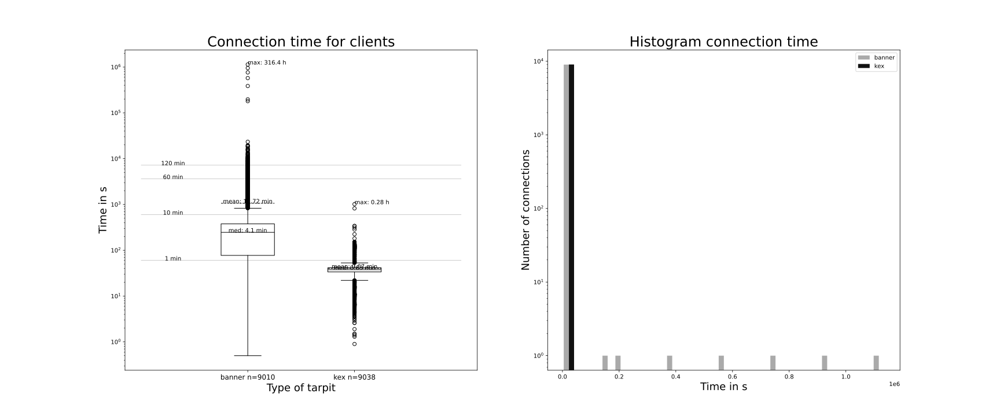

# ssh-tarpit
Inspired by [skeetos endlessh](https://github.com/skeeto/endlessh), this tarpit also works on the key exchange (kex) level to slow down ssh bots or malicious ssh clients and will use a database instead of logs for the trapped clients.

Depending on what is specified in the [compose file](./docker-compose.yml), ssh-tarpit randomly chooses between tarpitting at banner and kex level or tarpits always at banner or kex level.

### Banner level tarpit
> The server MAY send other lines of data before sending the version string.  Each line SHOULD be terminated by a Carriage Return and Line Feed.  Such lines MUST NOT begin with "SSH-", and SHOULD be encoded in ISO-10646 UTF-8 [RFC3629] (language is not specified).  Clients MUST be able to process such lines.

[RFC4253, 4.2]

The idea is to never send a line that begins with `SSH-` and therefore trap the client forever, because it will never get the answer it is waiting for.

### Kex level tarpit
> Key exchange (kex) begins by each side sending name-lists of supported algorithms.

[RFC4253, 7]

The idea is to send very large name-lists at slow speed. After the initial message, each message is sent as type `string`, which means
```
string

      Arbitrary length binary string.  Strings are allowed to contain
      arbitrary binary data, including null characters and 8-bit
      characters.  They are stored as a uint32 containing its length
      (number of bytes that follow) and zero (= empty string) or more
      bytes that are the value of the string.  Terminating null
      characters are not used.

      Strings are also used to store text.  In that case, US-ASCII is
      used for internal names, and ISO-10646 UTF-8 for text that might
      be displayed to the user.  The terminating null character SHOULD
      NOT normally be stored in the string.  For example: the US-ASCII
      string "testing" is represented as 00 00 00 07 t e s t i n g.  The
      UTF-8 mapping does not alter the encoding of US-ASCII characters.
```
[RFC4251, 5]

The packet size is sent first as uint32, which means the packet can be theoretically 4GiB large. Unfortunately,
> All implementations MUST be able to process packets with an uncompressed payload length of 32768 bytes or less and a total packet size of 35000 bytes or less [...]

[RFC4253, 6.1]

Because of these limitations, kex trapping will not last endless like banner trapping does and will also not reach its full potential, like when processing 4GiB of data was a requirement. At least it lasts a little while, when malicious clients are ready for an endless banner.

## Comparison of tarpits
The left side is a boxplot for both tarpits and on the right side is a histogram.



Meehhh... As visible in the graph, the banner tarpit traps much longer than the kex one. Either the ssh scrapers are more interested in the SSH-2 server type or I screwed something up.

# Quickstart
## Preconditions
Make sure that the following packages are installed
- podman
- podman-compose

and also that the machine is configured for the user running the containers with
- lingering enabled
  ```
  loginctl enable-linger
  ```
  that the containers do not stop when the user logs out.

- enabled podman restart service
  ```
  systemctl --user start podman-restart.service
  systemctl --user enable podman-restart.service
  ```
  that the restart policy works.

Ensure that
- Port 22 is available and not used by the real ssh server (for openssh, change the line `#Port 22` to `Port 999` or whatever number you like) or another service
- Port 22 can be used by a non-root user (add `net.ipv4.ip_unprivileged_port_start=22` to `/etc/sysctl.conf`)

*Docker might be used instead of podman. Make sure to substitute all podman commands with docker.*

## Setup
1. Clone this repository and enter its directory by running
   ```
   git clone https://github.com/kvnglb/ssh-tarpit.git
   cd ssh-tarpit
   ```
   on the server, that should use the trap.

1. Create and edit the .env file
   ```
   cp .env.example .env
   ```
   Then edit `.env` and choose the database passwords.

1. Optionally modify `docker-compose.yml` to your needs. Shouldn't be necessary, unless port `5444` is already used on your server.

1. Build and start the containers
   ```
   podman-compose build
   podman-compose up -d
   ```

1. If everything was successfull
   ```
   podman logs ssh-tarpit_ssh
   ```
   should only output `Connected to db` and no errors.

   ```
   podman logs ssh-tarpit_db
   ```
   should also not ouput any errors.

# Information about trapped clients
Enter the database with
```
podman exec -it ssh-tarpit_db psql -U ssh
```

To gather everything, run `SELECT * FROM ip;`
```
ssh=> SELECT * FROM ip;
 id | address | identifier | service | tarpit | time | timespan 
----+---------+------------+---------+--------+------+----------
```
- `id`: a consecutive number
- `address`: the ip address of the trapped client
- `identifier`: a unique string (md5sum) of the clients address and time of connection
- `service`: the name of the service, which the client is using [RFC4253, 4.2]
- `tarpit`: the used tarpit, either `banner` or `kex`
- `time`: the time when tarpitting the client had begun
- `timespan`: how long the client was trapped

## Useful postgresql statements
### Exit the database
```
\q
```

### Show longest timespan first
```
SELECT * FROM ip WHERE timespan IS NOT NULL ORDER BY timespan DESC;
```

### Show current trapped clients
```
SELECT * FROM ip WHERE timespan IS NULL;
```

### Export table as csv
```
\copy (SELECT * FROM ip) TO 'ip.csv' WITH CSV
```
Attention: Now, the file is in the container but not on the host. To copy the file from the container to the host, exit the database with `\q` and then run
```
podman cp ssh-tarpit_db:ip.csv .
```

